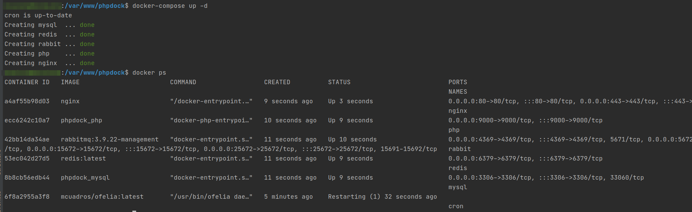

# phpdock

## [中文文档](readme_zh_CN.md)

<p align="center">⛵<code>phpdock</code> is a normal PHP environment for Docker, you can use it to build  the same PHP environment on your local,test,production environment.</p>


## Quick Overview

Let’s see how easy it is to setup our PHP, NGINX, MySQL, Redis and Composer

1 - Clone phpdock inside your PHP project: 

```
git clone https://github.com/ibiteam/phpdock.git
```

2 - Enter the phpdock folder and set env you need

```
cd phpdock
cp .env.example .env
cp docker-compose-example.yml docker-compose.yml
```

3 - Run your containers:

```
docker-compose up -d nginx mysql php redis
```

wait the images download and containers run , you wil see the services is up




# restart nginx
```
docker-compose restart nginx
```

# run `composer install` in php container ,The example assumes that the phpDock sibling has a 'laravel' folder，tips:Local files are mapped to the container `/var/www`
```
docker-compose exec -T php bash -c "cd laravel && composer install --no-dev"
```


# Documentation

### .env.example
* set redis password
```
REDIS_PASSWORD=123456
```

* set mysql database name 
```
MYSQL_DATABASE=phpdock
```

* set mysql root password
```
MYSQL_ROOT_PASSWORD=phpdock
```

* set mysql datas save path
```
MYSQL_DATA_PATH=./data/mysql
```

* set rabbitmq default vhost
```
RABBITMQ_DEFAULT_VHOST=phpdock
```

* set rabbitmq login user
```
RABBITMQ_DEFAULT_USER=phpdock
```

* set rabbitmq login user password
```
RABBITMQ_DEFAULT_PASS=phpdock
```

* set php use version ,options [72 , 74 , 81]
```
PHP_VERSION=74
```

* set php extension dir 
```
PHP_EXTENSION_DIR=/usr/local/lib/php/extensions/no-debug-non-zts-20190902
```

* set nginx config path,such as `local`,`test`,`production`,or you can define any path as you want
```
NGINX_CONF_DIR=local
```

* set timezone
```
TIME_ZONE=Asia/Shanghai
```

### files

```
cron      # run task schedules,more docs you can see `ofelia`,`config.ini.example` is a demo
data      # for mysql datas and redis datas 
logs      # nginx logs and redis logs
mysql     # mysql dockerfile
nginx     # nginx config files ,`production` conf is ignore,and need manual edit
php-fmp   # php dockerfile for php version
redis     # redis config
```
